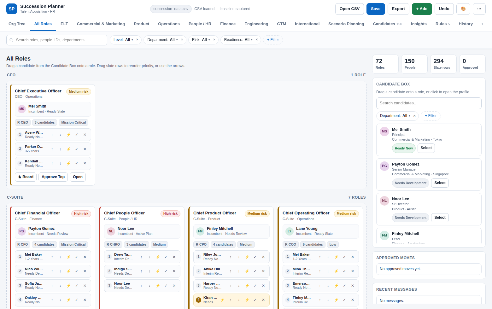
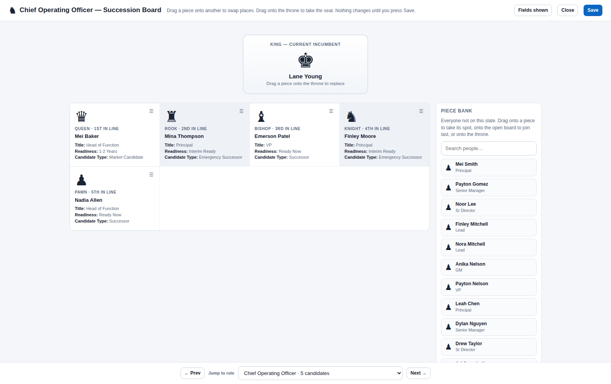

# Succession Planner

A complete succession-planning tool for HR teams in **one HTML file**, with a plain
CSV as its entire database. No install, no server, no accounts, no dependencies —
double-click the file, open your CSV, and plan.



## Why it's built this way

HR teams live in spreadsheets and shared drives. This tool meets them there:
the single `succession_planner.html` runs offline in any Chromium browser, and
the CSV it reads and writes is the same file analysts can open in Excel. There
is no build step, no framework, and no external request of any kind — the app
is self-contained down to writing and reading its own `.xlsx` workbooks.

## What it does

- **Succession boards** — roles grouped by level across custom tabs, with
  drag-and-drop candidate slates, ranked priorities, approvals, and automatic
  backfill cascades when a seat opens up.
- **A chess board for every role** — the incumbent as King, the slate as
  Queen→Pawn. Drag pieces to swap, drag onto the throne to stage a succession;
  nothing is real until Save. Piece assignment is configurable (by rank, or
  mapped from any field — e.g. *Ready Now = Queen*).
- **Org chart** — a pan/zoom reporting tree built from each role's *Reports To*
  field, with dashed inferred placement for roles that haven't been wired yet.
- **Rules engine** — plain-language guardrails: eligibility requirements
  (require or forbid a match, scoped to chosen roles), person-level movement
  blocks, and auto-backfill charts. One shared guard enforces rules on every
  path a person can move through — manual approvals, auto-moves, queues, and
  cascades.
- **Per-plan readiness** — the same person can be *Ready Now* for one role and
  *3–5 Years* for another; rules and boards read the plan-level value.
- **Insights dashboard** — coverage and vacancy KPIs plus user-built widgets
  (counts, %, sums, averages, bar/pie/donut) with multiple AND filter
  conditions and hover tooltips.
- **Customization without code** — add typed custom fields (text, number,
  true/false, dropdown lists), rename or hide built-in fields, re-type
  built-ins, and pick table columns. All of it stored in the CSV so the whole
  team shares one configuration.
- **Excel-grade import/export** — a self-contained xlsx writer/reader
  (STORE + DEFLATE zip handling, shared strings). Every import goes through a
  review with a per-change preview (old → new, uncheck to skip, edit inline),
  a revert guard that refuses to silently undo an approved move, and a
  downloadable error report. A 25,000-row sheet imports in under a second.
- **Sharing** — export one board or several (with the rules that govern them),
  or hand a colleague a copy of the program itself with chosen features locked
  off. Merge returned files back with full change review.
- **Safety** — 40-step undo, autosaved browser backup with crash recovery,
  remembered file handles (open → edit → Ctrl+S overwrites in place), and an
  append-only history log stored inside the CSV.



## Testing

The project is verified by a **158-scenario Playwright suite** that drives the
real UI in headless Chromium — clicking actual buttons, firing real
drag-and-drop, and asserting after every mutation that the change round-trips
through the CSV byte-for-byte. It covers hostile input (quote/comma/XSS
payloads), duplicate and dangling data, 3,000-person scale (full render in
~260 ms), the 25,000-row import cap, and a regression test for every bug ever
found. See [`tests/STRESS_TEST_REPORT.md`](tests/STRESS_TEST_REPORT.md).

```bash
npm install -g playwright   # once
NODE_PATH=$(npm root -g) node tests/stress_test.cjs
```

## Getting started

1. Download `succession_planner.html` and `succession_demo.csv`.
2. Open the HTML file in Chrome or Edge.
3. Click **Open CSV / Excel** and pick the demo file.
4. Follow [`DEMO_SCRIPT.md`](DEMO_SCRIPT.md) for a 5-minute tour, or the
   [Quick Start](Succession_Planner_Quick_Start.docx) /
   [full guide](SUCCESSION_PLANNER_GUIDE.md) for everything else.

| File | Purpose |
|---|---|
| `succession_planner.html` | The entire application |
| `succession_demo.csv` | Small demo dataset (every feature switched on) |
| `succession_data.csv` | Full-size test dataset (150 people / 72 roles) |
| `SUCCESSION_PLANNER_GUIDE.md` | User guide |
| `DEMO_SCRIPT.md` | 5-minute demo walkthrough |
| `tests/` | Playwright stress suite + report + screenshots |

## Technical notes

Vanilla JavaScript (~5,000 lines), zero runtime dependencies, one file.
Event-delegated UI (no inline handlers, no user data interpolated into code),
schema-stable CSV round-trips that preserve unknown columns, File System
Access API with IndexedDB-persisted handles, and a hand-rolled zip/xlsx layer.
Everything a framework would do is done deliberately and visibly instead.
